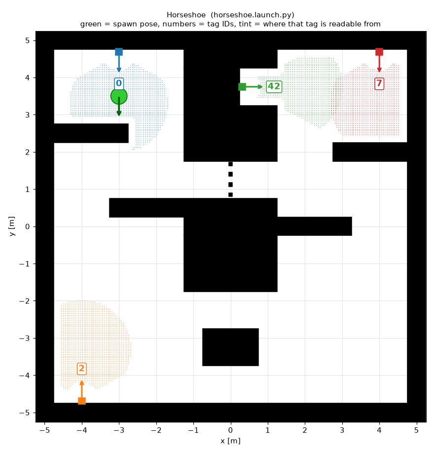
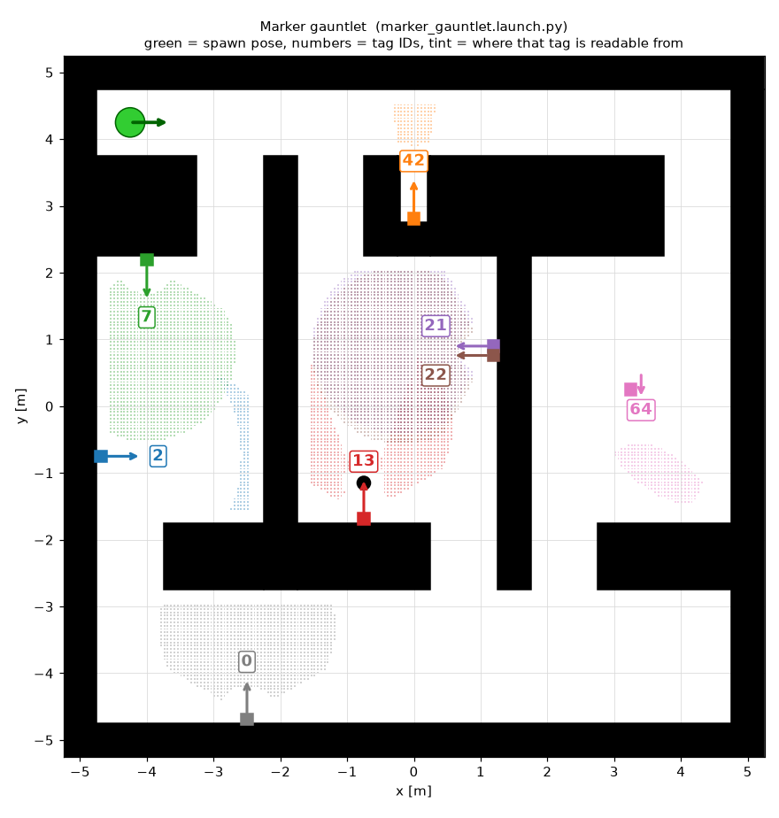
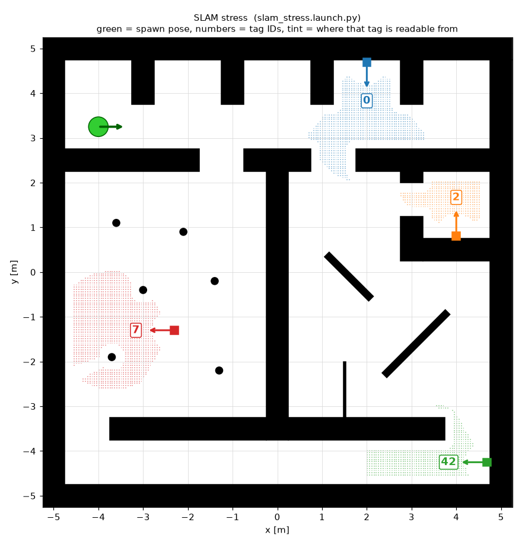

# metr4202_test_worlds

Three extra Gazebo Classic test environments for the METR4202 ArUco exploration task, built to the
same conventions as [metr4202_aruco_explore](https://github.com/METR4202/metr4202_aruco_explore):

* 10 m x 10 m arena, walls 0.5 m thick and 1 m tall (black boundary, grey interior), main corridors
  1 m wide or more
* the same "ArUco column" targets: a 0.12 m wooden post carrying a 100 mm `DICT_6X6_1000` tag
* a TurtleBot3 Waffle Pi spawned by the launch file, talking over the usual ROS 2 topics
  (`/scan`, `/odom`, `/cmd_vel`, `/camera/image_raw`, `/camera/camera_info`, `/tf`)

Each world targets one failure mode that the reference maze does not exercise.

| World | Launch file | Edge case |
|---|---|---|
| [Horseshoe](#1-horseshoe) | `horseshoe.launch.py` | U-shaped arena: targets that are close in a straight line and far by road |
| [Marker gauntlet](#2-marker-gauntlet) | `marker_gauntlet.launch.py` | Eight tags that are high, recessed, occluded, tilted, grazing, paired or behind you |
| [SLAM stress](#3-slam-stress) | `slam_stress.launch.py` | Featureless 9.5 m corridor, repeated bays, pillars, diagonal and thin walls, 0.75 m door |

> **Status: not yet launched in Gazebo.** The worlds were authored on a machine without ROS. They
> were checked geometrically (well-formed SDF, every floor area reachable by a 0.22 m robot, every tag
> readable from somewhere reachable, every texture decodes with `cv2.aruco`) and reviewed against the
> reference package, but the first real launch is yours. See [First launch checklist](#first-launch-checklist).

## Requirements

Identical to the reference package:

* Ubuntu 22.04, ROS 2 Humble, Gazebo 11 (classic)
* `turtlebot3_gazebo` (`sudo apt install ros-humble-turtlebot3-gazebo`, or built from
  [turtlebot3_simulations](https://github.com/ROBOTIS-GIT/turtlebot3_simulations))
* `gazebo_ros` and `robot_state_publisher`
  (`sudo apt install ros-humble-gazebo-ros-pkgs ros-humble-robot-state-publisher`)

The package is data only (worlds, launch files, textures), so there is nothing to compile and it does
not depend on `metr4202_aruco_explore` being installed.

## Install

This package lives inside the `4202_turtlebot` repository, which is itself a workspace `src` folder.

Already have the repo as your `src`:

```bash
cd ~/your_ws/src && git pull
```

```bash
cd ~/your_ws && colcon build --symlink-install --packages-select metr4202_test_worlds
```

Fresh workspace:

```bash
mkdir -p ~/your_ws/src && git clone https://github.com/mitchbradshaw/4202_turtlebot.git ~/your_ws/src
```

```bash
cd ~/your_ws && colcon build --symlink-install --packages-select metr4202_test_worlds
```

## Run

```bash
cd ~/your_ws && source install/setup.bash
```

```bash
ros2 launch metr4202_test_worlds horseshoe.launch.py
```

```bash
ros2 launch metr4202_test_worlds marker_gauntlet.launch.py
```

```bash
ros2 launch metr4202_test_worlds slam_stress.launch.py
```

Then start your own stack exactly as you would for the reference world (for example
`ros2 launch slam_toolbox online_async_launch.py use_sim_time:=true`, Nav2, your explorer and your
ArUco node).

The robot model follows `TURTLEBOT3_MODEL` if it is exported and otherwise defaults to `waffle_pi`.
Only the Waffle Pi has a camera.

Launch arguments (all optional):

| Argument | Default | Meaning |
|---|---|---|
| `aruco` | `true` | `false` loads the same maze without the tag columns (`<world>_no_aruco.world`) |
| `gui` | `true` | `false` runs `gzserver` only, which is faster and works over SSH |
| `odometry` | `world` | `encoder` makes `/odom` come from wheel rotation, so it starts at zero. See below |
| `odom_error` | `0.0` | with `odometry:=encoder`, a fractional wheel calibration error (try `0.03`) so `/odom` really drifts |
| `x_pose`, `y_pose`, `yaw` | per world | spawn pose in metres / radians, world frame |
| `use_sim_time` | `true` | passed to `robot_state_publisher` |

### Odometry: perfect by default

The stock TurtleBot3 Gazebo model does not set the diff-drive plugin's `odometry_source`, and the
plugin's default is the simulator's own ground-truth pose. Two consequences:

* `/odom` does not drift, so SLAM gets a perfect motion prior and the maps look better than they
  would on a real robot. The drift-related checks below will mostly pass trivially.
* `/odom` starts at the spawn pose, not at zero, so `odom`, and the SLAM `map` frame built on it,
  coincide with the Gazebo world frame.

`odometry:=encoder` spawns a copy of the same model with `<odometry_source>0</odometry_source>`. `/odom`
is then integrated from the wheels and starts at zero. On its own that is still very accurate, because
simulated wheels barely slip and the plugin knows their exact size. Add `odom_error:=0.03` to make the
plugin believe the wheels are 3 % larger and further apart than they are: `/odom` then over-reads
distance and under-reads turns, like a real robot with imperfect calibration, and SLAM has to earn
its map. Use both for the Horseshoe and SLAM stress worlds when you want mapping to be a real test:

```bash
ros2 launch metr4202_test_worlds slam_stress.launch.py odometry:=encoder odom_error:=0.03
```

Two caveats, neither checked in Gazebo yet: the same wheel numbers also convert `/cmd_vel` into wheel
speeds, so the robot drives about 3 % slower than commanded; and in encoder mode the plugin may report
the forward speed in `/odom` as positive even while reversing.

## Ground truth

Exact tag positions are in [docs/ground_truth.md](docs/ground_truth.md) and, machine-readable, in
[docs/ground_truth.json](docs/ground_truth.json), in two frames:

* **world**: the Gazebo world frame. Compare against this with the default `odometry:=world`.
* **spawn frame**: origin and +x at the default spawn pose. Compare against this with
  `odometry:=encoder`, or with any setup whose odometry starts at zero.

If unsure, run `ros2 topic echo /odom --once` right after launch. If it shows the spawn pose, your map
frame is the world frame; if it shows zeros, it is the spawn frame.

In the pictures below the green disc is the spawn pose, each numbered arrow is a tag and the direction
it faces, and the tinted patch is the floor area from which that tag should be readable (at least
20 px across, within 60 degrees of its normal, unoccluded, camera level). The 20 px and 60 degree
limits are deliberately conservative: `cv2.aruco` often decodes smaller and more oblique views, so
treat a small patch as "hard", not "impossible elsewhere".

---

## 1. Horseshoe



A U: two 3.5 m wide arms joined by a bend at the bottom, separated by a solid 2.5 m divider. The robot
starts at the top of the left arm **facing away from tag 0**, 0.75 m from the first baffle. Tag 7 at
the top of the right arm is about 7 m away in a straight line and about 18 m by road; tag 42 is about
3.4 m in a straight line and about 17 m by road.

What it tests:

* **Straight-line frontier or goal selection.** A 1 m tunnel through the divider at y = 0.75 to 1.75
  is closed by four 10 cm bars with gaps of 17.5 cm or less. The lidar sees through it, the robot
  cannot pass. Driving down the left arm, the lidar maps free space behind the bars (the far half of
  the tunnel, and a little of the right arm if the robot looks in from close up). Those frontiers are
  about 3 m away in a straight line and about 15 m away by road. An explorer that ranks goals by
  straight-line distance instead of path length will keep choosing them, and one that picks a goal
  right behind the bars will find it has no valid path at all.
* **Looking behind you.** Tag 0 is 1.1 m behind the spawn pose. An explorer that never does an
  initial spin, and never returns to the start, misses it.
* **A pocket off the route.** Tag 42 sits at the back of a 1 m x 1 m pocket in the divider, facing
  sideways across the right arm. It is only readable from a cone in front of the pocket.
* **Baffles.** Each arm has two staggered 2 m baffles with 1.5 m gaps, so the route is a chicane.
* **Long open-loop travel.** The arms never reconnect; the only loop is the small one around the
  island in the bend. With `odometry:=encoder odom_error:=0.03`, any error SLAM fails to correct on
  the way round shows up as the two arms not being parallel, the divider changing thickness, and
  position error on tags 42 and 7, with no large loop closure available to hide it.

A good run finds 0, 2, 42 and 7, never sends a goal beyond the bars from the left arm or plans a
route through the window, and produces a map in which the divider is 2.5 m thick above and below the
window (1.5 m at the pocket). Driving into the left half of the tunnel to map it is fine.

## 2. Marker gauntlet



Navigation here is deliberately easy: a 1 m corridor along the top, three rooms, and a 2 m wide
corridor along the bottom, all joined by 1 m doors. The difficulty is in the eight tags, listed from
the smallest readable area to the largest.

| ID | Name | What makes it awkward | What a robust solution does |
|---:|---|---|---|
| 42 | Recessed | Back of a slot 0.4 m wide and 1 m deep in the top corridor wall. Readable only when the camera looks into the slot from a strip roughly 0.5 m wide directly opposite; never while driving along the corridor. The slot is too narrow for the default Nav2 footprint (0.22 m radius). | Looks into openings instead of only along its path; does not send goals into the slot |
| 2 | High | 0.9 m up a 1 m post on the west wall of room A, which is 2.5 m wide. Closer than about 1.9 m the tag is above the camera's vertical field of view, so it is only readable from the far side of the room, looking back at the wall. | Scans walls from a distance, not just up close |
| 64 | Tilted | Free-standing 0.5 m post leaning back 45 degrees, so the tag faces half-way to the ceiling, sits about 0.39 m above the floor instead of 0.24 m, and is rotated 20 degrees in its own plane. Readable only from the south side. Mainly a test of the reported position and orientation. | Does not assume tags are upright, wall-mounted or at a fixed height |
| 13 | Occluded | A 0.2 m pillar stands with its centre 0.48 m in front of the tag face. The tag is hidden from a band roughly 1 m wide straight in front of it and readable from either side. | Keeps looking from other angles when a likely target is blocked |
| 0 | Grazing | Flat on the south wall of the 2 m corridor. Driving along the corridor it is not seen at all from the north half, and from the south half only near the image edge at 60 degrees or more off its normal, about 10 to 25 px wide, for a few frames. Such a detection has a poor pose. | Re-observes from in front before trusting a pose; weights grazing detections down |
| 7 | Behind you | Beside room A's north doorway, facing into the room. Optically easy; the difficulty is behavioural. It is never in view while entering through the north door, and is found only if the robot looks back, spins, or comes in from the south door. | Turns around or spins inside rooms |
| 21, 22 | Pair | Two different IDs on adjacent posts, 14 cm apart. | Reports two targets with two distinct positions |

A good run reports all eight IDs, each once, with the pair resolved as two positions 0.14 m apart, and
positions within your tolerance of [the ground truth](docs/ground_truth.md). The number found out of
eight is a direct score for the search strategy; the position error on 0 and 64 is a score for the
pose estimate.

## 3. SLAM stress



The four tags are straightforward; the geometry is not. The Waffle Pi lidar has a 3.5 m range.
The pillars, diagonals, thin partition and narrow doorway test navigation and costmaps with any
odometry. The corridor, loop-closure and bay checks need `odometry:=encoder odom_error:=0.03` (or
more): with perfect or near-perfect odometry SLAM cannot get them wrong.

* **Featureless corridor** (bottom, 9.5 m x 1 m). In the middle of it the lidar sees two parallel
  walls and neither end wall, so scan matching cannot observe motion along the corridor: for about
  0.6 m there is no along-corridor cue at all, and for about 2.5 m the only cue is where the wall
  returns stop at the openings. The estimate there rides on odometry, so with an odometry error the
  corridor comes out too long or too short.
* **A single loop that closes through that corridor.** Top corridor, pillar hall, long corridor,
  east room, back to the top corridor. The two rooms are not connected to each other, so there is no
  short cut: an error in the corridor length has to be absorbed at the loop closure, and appears as
  a doubled or sheared wall if it is not.
* **Repeated bays** (top). Five 1.5 m bays at a 2 m pitch. The doorways, end walls and the tag post
  break the symmetry, so this is repetitive structure rather than true aliasing. Expect it to matter
  only when odometry is poor enough for the matcher to be searching a metre or more.
* **Pillar hall** (west room). Six 16 cm round pillars and tag post 7. Thin objects give few lidar
  returns, are easy to lose from a costmap and easy to clip.
* **Diagonal walls** (east room). Two 45 degree walls, 15 cm thick, for anything that assumes a
  Manhattan world.
* **Thin partition** (east room). 5 cm thick, 1.25 m long. Seen end-on it is one or two returns.
* **0.75 m doorway** into the closet that holds tag 2, which can only be read from the mouth of the
  doorway or inside. A Waffle Pi is 0.31 m wide so it fits with 0.22 m to spare each side, and the
  robot centre can stay 0.375 m from both jambs. A planner whose effective robot radius is above
  that will refuse the door; with the stock 0.22 m radius it is passable but expensive. The passages
  needed for tags 0, 42 and 7 are all about 1 m wide; the east room also has 0.8 to 0.9 m gaps
  around the diagonal walls, including on the loop's way from the long corridor into the room.

A good run closes the loop without a doubled wall, keeps the five bays at a 2 m pitch, shows both
diagonals and the thin partition in the map, enters the closet, and finds tags 0, 2, 42 and 7.

---

## Differences from the reference package

* The tag columns are `static`, so the robot cannot knock them over and the ground truth stays valid.
* Each column is one link with two visuals (post and tag plate) at plain poses. The reference uses a
  second link, a fixed joint and an SDF `<frame>`; the plate ends up in the same place with the same
  orientation, 0.24 m up the post like the reference model.
* All walls are one static model (`maze`) with one collision and visual per wall segment.
* Materials are named `tw_aruco_6x6_100mm_<id>` and textures `tw_6x6_1000-<id>.png` so they cannot
  clash with the reference package if both are on `GAZEBO_RESOURCE_PATH`.
* Extra tag IDs 7, 13, 21, 22 and 64 were generated with `cv2.aruco` from `DICT_6X6_1000` in the same
  354 px, no-margin format as the reference textures for IDs 0, 2 and 42.
* The launch files default `TURTLEBOT3_MODEL` to `waffle_pi`, accept a spawn `yaw`, and add the
  `aruco`, `gui`, `odometry` and `odom_error` arguments.

## First launch checklist

Nothing here has been run in Gazebo yet, so on the first launch check:

1. The launch log prints `GAZEBO_RESOURCE_PATH: ...` ending in `share/metr4202_test_worlds/resource`.
2. The tags show their black-and-white pattern (not plain white or grey), on the face pointing the
   way the arrow points in the picture, 0.24 m up the post (except gauntlet tags 2 and 64).
   `ros2 run rqt_image_view rqt_image_view` on `/camera/image_raw` should decode them.
3. `ros2 topic echo /odom --once` shows the spawn pose (default) or zeros (`odometry:=encoder`), and
   with `odometry:=encoder` the log says `spawning /tmp/metr4202_test_worlds_waffle_pi_encoder_<uid>.sdf`.
   Drive a 2 m straight line with `odom_error:=0.03` and confirm `/odom` reads about 2.06 m.
4. `gzserver` prints no SDF errors for `maze` or `aruco_column_*`.

## Editing a maze

Everything is generated from the `WORLDS` table in [tools/generate_worlds.py](tools/generate_worlds.py),
where each maze is a 21 x 21 ASCII map (one character = 0.5 m) plus lists of tags and extra shapes.

```bash
python3 tools/generate_worlds.py --previews
```

rewrites the worlds, launch files, pictures and ground truth, and fails loudly if any floor area is
unreachable or any tag is unreadable. It needs `numpy` and `matplotlib`; `--textures` additionally
needs `opencv-contrib-python` and is only required when you add a new tag ID.

## Troubleshooting

* **Gazebo does not start or hangs.** Same advice as the reference package: `Ctrl-C`, wait, retry; or
  `killall -s SIGKILL gzclient gzserver` and run again.
* **Tags are plain white or grey.** Gazebo did not find the materials. Check item 1 of the checklist,
  rebuild, and re-source `install/setup.bash`.
* **File not found for the TurtleBot3 URDF or SDF.** `turtlebot3_gazebo` is not installed or not sourced.
* **Reported tag positions are off by a constant several metres.** You are comparing against the
  wrong frame; see [Ground truth](#ground-truth).
* **No camera topics.** `TURTLEBOT3_MODEL` is exported as `burger` or `waffle`; unset it or set `waffle_pi`.
